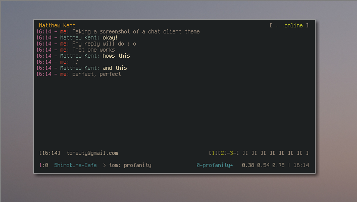

# profanity-gruvbox
Gruvbox colors for XMPP client Profanity

Works best with [gruvbox terminal colors](https://github.com/morhetz/gruvbox-generalized).

###Usage
Copy to `~/.config/profanity/themes`
In `profanity`:
  `/theme load gruvbox`
  
###Screenshot

